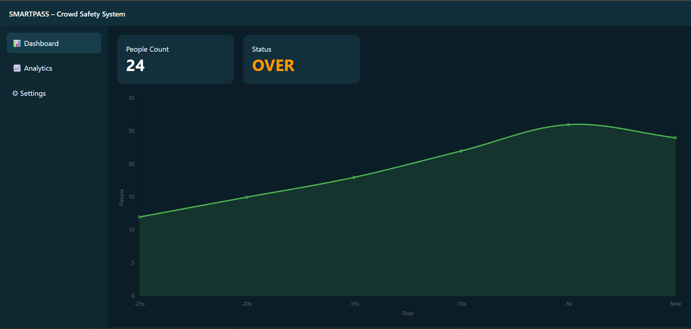
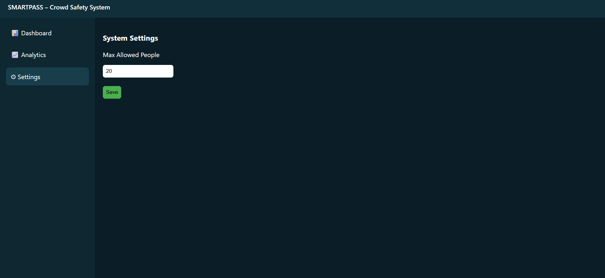
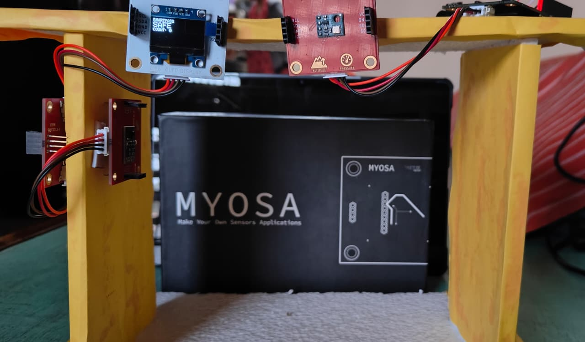

> Detect early. Prevent panic. Save lives.

---

## Acknowledgements

This project was developed as part of MYOSA 4.0 with the objective of building a deployable, privacy-respecting crowd safety system for real-world environments.

---

## Overview

SmartPass is an intelligent crowd monitoring and safety system designed to **prevent stampede-like situations before they become dangerous**.

Unlike traditional CCTV or manual monitoring solutions, SmartPass uses **multi-sensor fusion** to continuously monitor crowd flow, overcrowding levels, and abnormal panic movement in real time.

The system is designed for:

- Colleges & schools  
- Hospitals  
- Event entry gates  
- Public corridors & transit areas  

### Key Highlights

- Real-time people entry/exit counting  
- Early overcrowding warning (non-panic alert)  
- Stampede risk detection using vibration & pressure  
- Live web dashboard with analytics  
- Privacy-respecting (no cameras, no face tracking)

---

## Demo / Examples

### **Images**

<p align="center">
  <br/>
  <i>Live SmartPass dashboard showing people count, status, and analytics</i>
</p>
<p align="center">
  <br/>
  <i>Live SmartPass dashboard  Risk distrubution</i>
</p>
<p align="center">
  <br/>
  <i>Live SmartPass dashboard  Setting Max capacity</i>
</p>
<p align="center">
  <br/>
  <i>SmartPass hardware prototype with ESP32 and sensors</i>
</p>

---

### **Videos**

<video width="100%" controls poster="smartpass-cover.png">
  <source src="smartpass-demo.mp4" type="video/mp4">
</video>
## Video Demonstration

▶ **SmartPass – Intelligent Crowd Safety System (Working Demo)**  

[Click here to play the demo video](smartpass-demo.mp4)

The video demonstrates:
- Real-time people entry and exit counting  
- Overcrowding alert (OVER state)  
- Stampede detection using vibration and pressure sensors  
- Live web dashboard with alerts  

---

## Features (Detailed)

### **1. Real-Time People Counting**

SmartPass uses an optical gesture/proximity sensor at the entry gate to accurately detect **entry and exit direction**.

- Entry and exit logic is direction-locked to avoid false counts  
- Automatic exit due to noise is prevented using cooldown logic  

---

### **2. Overcrowding Detection**

When the number of people exceeds a configurable safe capacity:

- System status changes to **OVER**
- A soft **dip-dip alert** is triggered (non-panic)
- OLED and dashboard both display **OVER**

This allows authorities to act **before** panic starts.

---

### **3. Stampede Risk Detection (Multi-Sensor Fusion)**

Stampede risk is detected using **sensor fusion**:

- **MPU6050** detects abnormal vibration and sudden crowd movement  
- **BMP180** detects sudden air-pressure fluctuations caused by crowd compression  

If either or both signals exceed safe thresholds:

- Status switches to **DANGER**
- Continuous alarm is activated
- Dashboard shows **STAMPede ALERT**

This design reduces false positives and improves reliability.

---

### **4. Live Web Dashboard**

The system hosts a built-in web dashboard on ESP32:

- Sidebar navigation (Dashboard / Analytics / Settings)
- Live people count
- Status indicators (SAFE / OVER / DANGER)
- Line chart with labeled axes
- Donut chart showing risk distribution
- Live pop-up alerts

---

### **5. OLED & On-Device Alerts**

Even without the dashboard:

- OLED displays current system status
- Buzzer alerts indicate risk level
- System works fully offline

---

## Usage Instructions

1. Power the SmartPass device
2. Connect to the same Wi-Fi network
3. Open the ESP32 IP address in a browser
4. Monitor live crowd data
5. Set maximum capacity from the Settings tab

---

## Tech Stack

- **ESP32**
- **APDS9960** – Entry/Exit sensing  
- **MPU6050** – Vibration detection  
- **BMP180** – Pressure sensing  
- **OLED Display (SSD1306)**
- **C / C++ (Arduino Framework)**
- **HTML, CSS, JavaScript**
- **Chart.js**

---

## Requirements / Installation

```bash
Install Arduino IDE
Install ESP32 board support
Install libraries:
- Adafruit SSD1306
- Adafruit MPU6050
- Adafruit BMP085 Unified
- WiFi & WebServer (ESP32)


